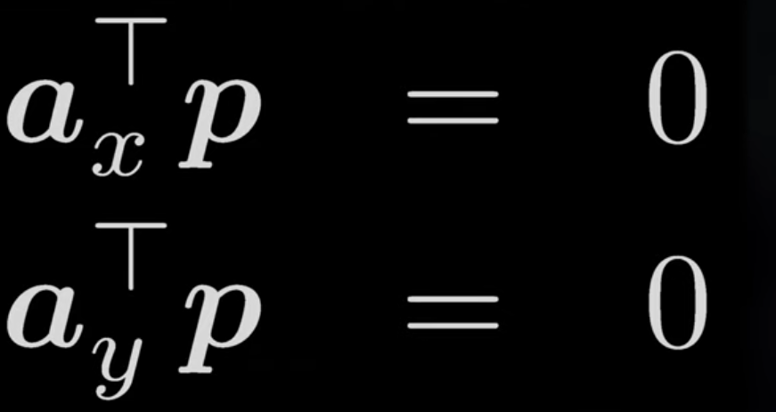

# Penjelasan Direct Linear Transformation

- Teknik untuk melokalisasi kamera anda dan memperkirakan parameter linier kalibrasi anda 

- setidaknya ada 6  titik 3d points di dunia (koordinat xyz dan satu gambar dari kamera )

- sebagian orang menyebut dlt sebagai pemetaan yang memetakan suatu titik dari dunia 3d ke bidang 2d dari kamera

- DLT = mengestimasi semua parameter dari sebuah kamera yang halus

- 11 DOF = 6 ekstrinsik parameter dan 5 instrinsik parameter

- Extrinsics = dimana letak kamera & kemana arahnya

- Intrinsics = pada dasarnya adalah parameter yang ada di dalam kamera

- estimate 11 parameters from a single image

## apa yang dilakukan DLT : 

- X = lokasi suatu titik di dunia 3d jadi pada koordinat xyz
- x = lokasi dimana titik ini dipetakan pada bidang gambar 2d
- P = 
    - adalah matriks yang sebenarnya menjelaskan pemetaan
    - koordinat homogen
    - 3x4 matriks sehingga memiliki 12 nilai yang perlu di isi.
    - DLT memungkinkan memperkirakan 12 parameter tersebut.

### kita dapat mendapatkan persamaan di bawah :

a = koefesien vektor

p = yang tidak diketahui matriks berdimensi 12

- dari setiap titik akan memberikan 2 titik pada vektor p yang tidak diketahui

        M.p harus sama dengan 0
        M = matriks yang diketahui seluruhnya
        p = 12 matriks yang tidak diketahui

- menyelesaikan sistem homogen dengan menggunakan SVD (singular vealue decmposition)
- Menyusun kembali vektor 12-dim ke dalam matriks P

### yang ingin kita cari sebenarnya : 

- R = matriks rotasi
- Xo = posisi dari kamera
- K = kalibrasi matriks

        p -> R, Xo, K
---
## Kesimpulan : 
DLT (Direct Linear Transformation) adalah standar untuk melokalisasi kamera dan memperkirakan parameter kalibrasi linier dari 6 titik atau lebih