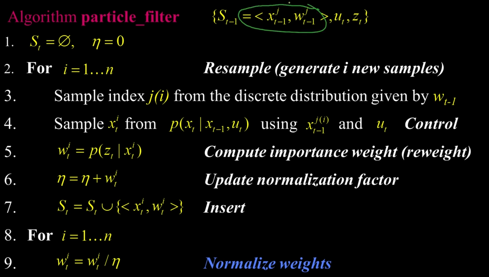

# Particle Filter
## Algorithm particle_filter


1. xj(t-1), wj(t-1) = set of particle.
partikel memiliki keadaan :

    - xj(t-1) = posisi
    - wj(t-1) = beratnya 

2. u = new action (tindakan yang baru) melangkah ke sebuah pertemuan, contohnya ke kanan 2 meter

3. z = pengukuran baru dari new action

dimulai dari,
1. insialisasi :
    - St = kosong
    - Normalisasi = 0

2. melakukan ini sebanyak n (n = banyak partikel yang dibutuhkan) kali :

    1. mengambil sampel partikel j(i) dari distribusi sebelumnya yang berasal dari distribusi xj(t-1), wj(t-1), berdasarkan beratnya (w(t-1)).

    2. (_langkah gabungan_) dikatakan control & difusi.
        - kita mengambil sampel status terbaru menggunakan 2 hal
            - Xt-1 = sampel lama
            - Ut = tindakan
        - kemudian, kita harus mengambil sampel dari distribusi baru 

        ```
        contoh:
        - anggap tindakan tersebut mengambil langkah ke kanan
        - tidak semua sample akan baik baik saja
        ```
    3. Lalu, menimbang ulang sampel tersebut. Menimbangnya dengan seberapa besar kemungkinan pengukurannya
    ```
    wi(t) = p(Z(t)|Xi(t))
    - p(Z(t)|Xi(t)) = kemungkinan pengukuran
    - wi(t) = bobot baru 
    ```
    4. kita hanya mencatat jumlah bobot baru tersebut
    ```
    n = n + Wi(t)
    ```
     
    5. kita menambahkan partikel tersebut ke kumpulan partikel yang terus bertambah, yang kita lakukan sebanyak n kali
    ```
    St = St U {<Xi(t), Wi(t)s>}
    ```
    - jumlah bobot dari setiap partikelnya harus 1