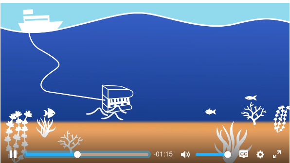
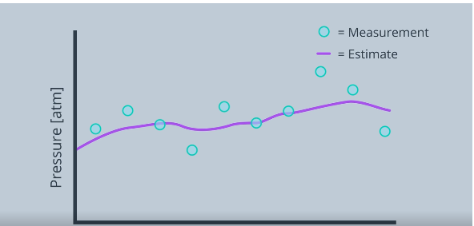
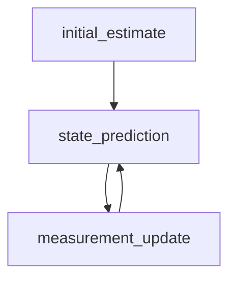

# Kalman Filter
 i've learned it in udacity

- Kalman Filter adalah algoritma untuk estimasi. 
- Estimasi bisa terjadi real time selama data sensor masih dapat diterima.
- bisa merepresentasi lokasi dan kecepatan dari robot

Contoh :

misalkan ada suatu benda yang di pasang sensor untuk menghitung ke dalaman dari suatu benda. Itu tidak akan stabil dikarenakan pasti ada suatu gelombang dalam laut. namun, bisa di estimasi dengan kalman filter.
ini adalah grafik jika sudah memakai kalman filter :

### terbagi jadi 2 step :
1. **Measuremant Update** (Pembaruan yang terukur) : menggunakan rekaman pengukuran untuk memperbarui statenya

2. **State Prediction** : menggunakan keadaan sebelumnya untuk memprediksi keadaan yang akan datang.

